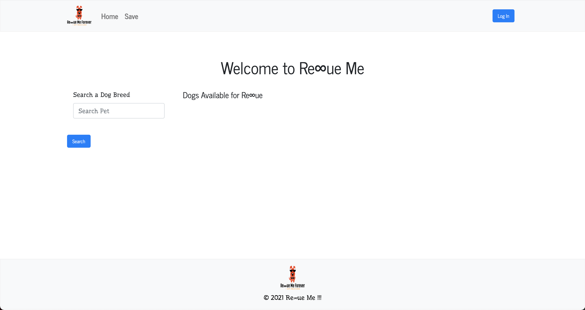

# Rescue Me Forever 

Rescue Me Forever was designed with you in mind. This app was generated to help find special homes for dogs. RMF gives you the capibility to search and read through dog profiles, option to login and save dogs that you want to view later, and it takes you to the adoption page to learn more about dog you selected. 


# Roadmap

Ability to search for any animal and breeds that could be adopted. 
Cability to search for specific color/size/and type of animal to adopt.
optiont to take a personality quiz to help you find an animal that would beset suit you best.
etc


# Visuals




# Easy User Authentication for React Apps

This repository hosts a React project that defines a Single-Page Application (SPA). You'll secure access to some of its routes using Auth0 User Authentication.

## Get Started

Install the client project dependencies:

```bash
npm install
````

Run the client project:

```bash
npm start
```

The application runs by on port `4040` to mitigate conflicting with other client applications you may be running.

Visit [`https://github.com/hlamkins/Final-Project`](https://github.com/hlamkins/Final-Project) to access the starter application.


# Authors and acknowledgment

Heather Lamkins, Ryan Conran, Liam Bambery, Yeem (Steve) Chij Thao, Randy Whitley, Nadirah Jama


